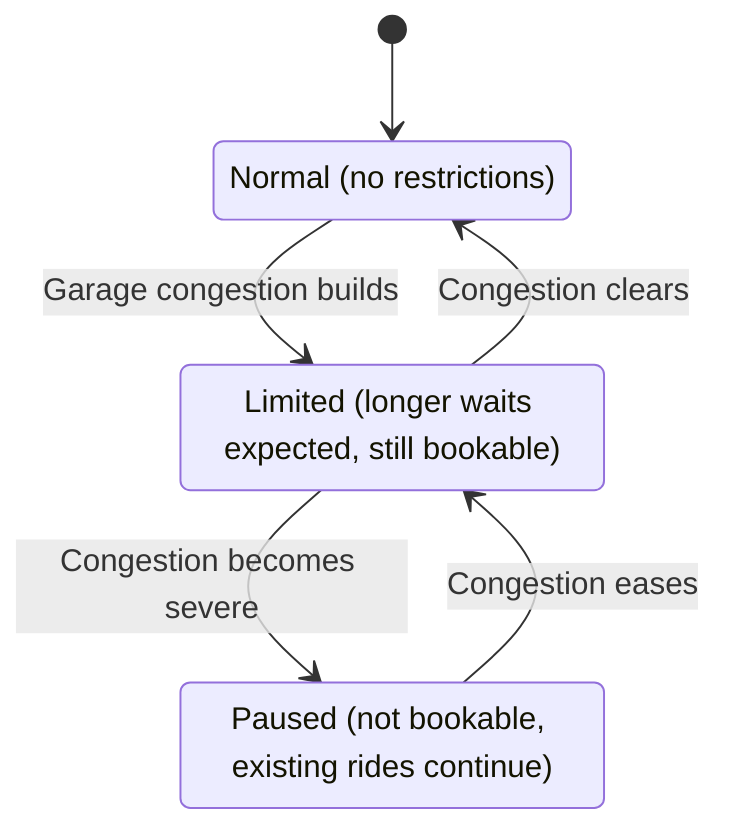

# When You Can't Serve Everyone at Once, Who Waits?

*A product and systems design problem worked through ahead of launch, for a ride-dispatch app serving a large, multi-destination venue.*

## The problem

At certain times, the parking garage pickup point at this venue gets so congested that a driver sent there can take far longer to complete that one ride than any other ride at the venue. Every driver stuck in garage traffic is a driver not available for anyone else. Left alone, the garage's congestion could quietly drag down service for every single guest at the venue, not just the ones headed to the garage.

There are two easy answers, and both are wrong. Let every single request to the garage through no matter what, and service gets slower for every guest at the venue, not just the ones going there. Shut the garage down completely the moment it gets busy, and the guests who parked in the garage are left confused, wondering if the app is broken, with no way to get back to their own car. What was actually needed was something in between: keep things predictable for most guests at the venue, and be upfront with the smaller number of guests affected by garage congestion about why they're waiting longer.

## Defining "fair" before writing any code

The genuinely hard part of this feature wasn't the dispatch logic. It was that "fair" turned out not to mean one single thing, and the system needed a real, written answer before anything could be measured or built.

Consider a hypothetical to see why. Say a busy period causes 5 large group bookings headed to the garage to get delayed, while 100 small, single-rider bookings elsewhere at the venue go through on time. Counted by booking, that's "5 bookings affected out of 105," which sounds like the system is working exactly as intended. Counted by person, if those 5 bookings average 10 people each, that's 50 real individuals waiting, against maybe 100 total people served on time. Same event, two honestly different pictures of how fair it actually was.

Neither count is more correct than the other. The real question isn't which number is right, it's which one this specific product actually needs to protect: keeping the ride experience predictable for most guests at the venue, even if that means a smaller number of people wait longer during busy periods.

Once that's clear, the next question is how to actually measure it, by counting bookings, or by counting people. The answer was: track both, on purpose, rather than picking one and hoping it tells the whole story. Four specific numbers came out of that: how long someone waits before a driver is assigned to them, how long their entire trip takes from booking to drop-off, and a version of each of those two, adjusted for how many people are in the group. Those group-adjusted versions exist for one reason: without them, a genuinely bad day for a handful of large groups could get completely hidden behind a booking count that still looks perfectly fine on paper.

## Three states, not a switch

Instead of a simple on/off switch, the garage pickup point has three possible states: Normal, Limited, and Paused.

In the Normal state, there are no restrictions at all. The garage works like any other pickup spot at the venue.

In the Limited state, a guest can still request a ride to the garage. Before they do, they're shown a clear, upfront message telling them the wait for the garage may be longer than usual right now. It's their choice from there. They can go ahead and book a ride to the garage anyway, or pick a different pickup point at the venue instead. Nothing is decided for them.

In the Paused state, new ride requests to the garage aren't accepted at all. Anyone who's already on their way to the garage, or already picked up there, keeps going completely uninterrupted, only brand new requests are affected.

The Limited state is where most of the actual engineering happens. Instead of blocking the garage outright, the system puts a cap on how many active rides can be heading to the garage at the same time. If a new request to the garage would go over that cap, it isn't turned away, it just waits for the next round and gets reconsidered then, keeping its place in line rather than losing its spot entirely. That one choice, waiting its turn instead of being rejected outright, is what keeps this fair over the course of a whole busy period, not just in a single moment.

There's also a backup check for a case the Limited state's cap alone can't solve: an especially long, severe traffic backup at the garage that doesn't ease up on its own. If the typical wait for the garage stays several times worse than the rest of the venue for a sustained period, that's treated as a signal that the specific number chosen for the garage's ride cap, how many rides are allowed there at once, may need to be adjusted, rather than something left to quietly continue as is.

## The recovery detail that almost got missed

Here's a small decision that says more about the actual product thinking than anything else in this feature. When garage congestion clears and the garage reopens, what should the app say to a guest who avoided the garage while it was Limited or Paused?

The instinct is to announce it, something like "good news, the garage is back." The actual decision was the opposite: say nothing at all. Just quietly make the garage selectable again, the same way it always was. Announcing a recovery implies there was something broken to recover from, and reinforcing that framing does more damage to trust in the system than just letting the guest notice, on their own, that the garage is working normally again.

## What had to be nailed down before a single screen was built

A working list of tricky situations got written down and given a clear answer before a single screen was built, not figured out midway through building it. A few real examples:

What happens if a guest is already waiting for a ride to the garage, and the garage suddenly gets Paused? Answer: they keep their place in line and still get picked up normally. Being Paused only stops brand new requests to the garage, it doesn't touch rides already in progress there.

What happens if a guest is right in the middle of finishing a ride request to the garage at the exact moment the garage's state changes, say, from Limited to Paused? Answer: the system checks the garage's real, current state at that final moment, not whatever it showed a few seconds earlier, so nobody accidentally books a ride to the garage under information that's already gone stale.

What happens if a guest was told to expect a longer wait for the garage, but a driver actually becomes free sooner than that? Answer: they just get picked up sooner. Nobody is artificially delayed to match an estimate that turned out to be pessimistic.

None of these are edge cases in the dismissive, "we'll get to it later" sense. Each one is a real moment where a guest either trusts the app a little more, or a little less.

## By the numbers

Four genuinely different ways to define fairness were named and worked through, on purpose, rather than picking whichever one happened to be easiest to measure. Six distinct tricky situations were identified and given a clear, written answer before a single line of code was written for them. And the actual limit chosen for how many rides could be active toward the garage at once wasn't left vague, it was narrowed down to a specific, deliberately small range: one to three at a time.



## The Why

It's tempting to treat a feature like this as purely a coding problem and just start building. But most of the real work here happened before any code was written: deciding what "fair" actually means for this product, writing that decision down in plain language, and thinking through how it would actually feel to a guest on the receiving end of it, right down to a detail as small as staying quiet instead of announcing a recovery. Once those decisions were made and written down clearly, the actual code was the easy part.

## Code Sketch

<details>
<summary><b>Show the code sketch: the garage cap rule</b></summary>

<br>

*A simplified illustration written for this write-up, not production code. It covers the Limited state, where a cap on active rides decides who gets served this round and who waits.*

```ts
type Mode = "normal" | "limited" | "paused";

interface Garage {
  mode: Mode;
  cap: number;         // most active rides allowed at the garage at once
  activeCount: number; // rides currently active to or from the garage
}

interface RideRequest {
  vehiclesAssigned: number; // 0 means brand new, more than 0 means partly served
}

// Decide whether the dispatcher may work on this request in this round.
// Returning false does not reject the request. It stays in the queue,
// keeps its place, and is looked at again next round.
function canDispatch(request: RideRequest, garage: Garage): boolean {
  // Normal needs no limits. Paused is enforced earlier, at booking time.
  if (garage.mode !== "limited") return true;

  // A party that already holds a slot must be allowed to finish. If the cap
  // blocked it, a large party could wait forever for its second vehicle
  // because its own first ride counts against the limit.
  const isPartlyServed = request.vehiclesAssigned > 0;
  if (isPartlyServed) return true;

  // Only brand new requests are held back once the cap is reached.
  return garage.activeCount < garage.cap;
}
```

The test that matters most protects the situation that would otherwise deadlock:

```ts
const atCap: Garage = { mode: "limited", cap: 2, activeCount: 2 };

test("lets a partly served party get its next vehicle even at the cap", () => {
  assert.equal(canDispatch({ vehiclesAssigned: 1 }, atCap), true);
});
```

Some parties are too big for one vehicle, so they are served in pieces. Once the first vehicle is assigned, that party already counts against the cap. If the cap applied to it again, a party of twelve could sit at the limit forever, waiting for a second vehicle that its own first ride is blocking. So the cap only applies to brand new requests, and anything already in motion is allowed to finish.

The full sketch, with all four tests and a note on a choice I made on purpose, is in [code-sketch.md](code-sketch.md).

</details>
