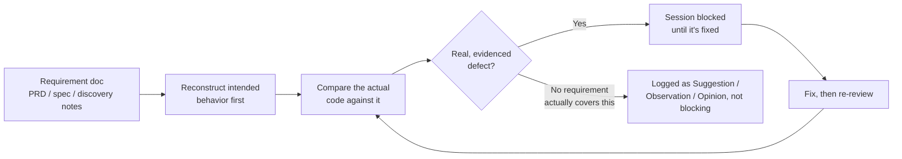

# A Code Review Process That Can Block Me From Stopping Until It's Satisfied

*Built while developing a ride-dispatch app for iOS and Android, as the product builder using AI-assisted development.*

## The problem

Building solo with an AI assistant has a specific failure mode that doesn't show up in the usual list of AI risks. It's not that the AI writes bad code. Most of the time the code is fine, it compiles, the tests pass, and it reads like something a competent engineer would write. The actual risk is that a wrong explanation delivered fluently is almost as convincing as a correct one, and when the same assistant that wrote the code is also the only one looking it over, there's no second engineer in the room to say "wait, that's not right."

I didn't want to just trust my own read of my own AI-assisted work. I wanted something that would actually argue with me.

## What I built

Every real change goes through a second AI reviewer, separate from and with no visibility into the reasoning of whichever assistant wrote the code, running against the actual working-tree diff, not a summary of what changed. There are two ways it gets invoked: I can trigger it myself at any real checkpoint, and there's a stop-time gate that runs automatically and can flatly refuse to let a work session end if it has an unresolved finding. Not a warning I can dismiss. A block.

Every finding gets sorted into one of four categories: Defect, Suggestion, Observation, or Opinion, and each one is tagged with how confident the reviewer actually is in it, confirmed by evidence, plausible but unverified, or couldn't be checked at all. That distinction matters more than it sounds like it should. "The reviewer had an opinion about naming" and "the reviewer found a defect that will corrupt data" are not the same thing, and a process that lets them blur together isn't actually protecting anything.

## Grounded in what the product is supposed to do, not just whether the code runs

A clean, fully-tested change that does the wrong thing is still wrong, and a reviewer that only looks at the diff will never catch that, because a well-written wrong answer reads exactly like a well-written right one when all you're checking is the code. The actual rule the reviewer operates under is stricter than "check the code": reconstruct what the software is supposed to do first, before ever looking at what it actually does. Only once that's written down does it become fair to compare the implementation against it.

That ordering is deliberate, and it cuts both directions. If the requirement doesn't actually establish the behavior in question, the reviewer is not allowed to invent one and penalize the code for missing it. A finding has to trace back to something real and written down, or it doesn't get to call itself a finding.

That shows up in the findings themselves, not just in the process description. One requirement I'd written down stated plainly that if a permission request is denied, the person should be shown a fallback option with an explanation, no exception carved out for which kind of denial it was. I'd written code that satisfied that for one denial state and silently skipped it for the other. My own tests passed. The app ran fine. The reviewer caught it because it had actually reconstructed that requirement first and checked the code against it, not because anything about the code looked wrong sitting there on its own:

```
Requirement (summarized, not a direct quote): offer a fallback with an
explanation whenever permission is denied, with no carve-out for which
kind of denial it was.

Finding: the explanation only rendered for one of the two possible
denied states. The other left the person with no explanation at all,
silently failing a requirement that had no exception written into it.
```

Nothing in that finding is a syntax complaint. It's a straight comparison between what was written down as required and what the code actually did, and the two didn't match.

Here's the shape of that pass, start to finish:



The step that matters most is the one on the far left. Everything downstream of it is only as trustworthy as whether that first box was actually done, and not skipped in favor of just reading the diff.

## How it actually plays out

Most findings are the kind you'd expect: a lock that doesn't cover everything it claims to, a signal that isn't handled the way the code assumes it is. But one of the more useful ones wasn't a code bug at all. In one round, the code reviewer flagged that a piece of new, user-facing copy had gone into the build without ever actually being approved by a person, mine or anyone else's. It was right. I'd written what felt like a reasonable placeholder, moved on, and never circled back to turn it into an actual decision. The fix wasn't a code change. It was going and getting a real answer, then writing down that the answer had been given, so the next person (or the next version of me) wouldn't have to guess whether that line of copy was intentional or just something that slipped through.

That's the case that convinced me the gate was worth the friction. It wasn't just catching bugs. It was catching decisions I'd made without actually making them.

## By the numbers

Fifteen distinct, confirmed findings across a single focused day of work on one feature area. Not fifteen mentions of the same two issues restated. Fifteen genuinely different failures: a lock that didn't cover what it claimed to, a signal that silently orphaned a running process instead of stopping it, a boolean that couldn't hold a distinction the system actually needed, a piece of copy that went in without approval, an emulator reset that could run while another test was still depending on the state it was about to wipe.

Two of those were more interesting than "the reviewer caught a bug." In one round, I checked the reviewer's own claim against the actual source code it was citing, and found the reviewer had named the wrong platform, even though the underlying concern was completely real. I fixed the actual defect and corrected the reviewer's mistake in the same pass. That's the part of this process I actually care about most: it's built to be checked, not obeyed. A review process that gets treated as automatically correct just because it's rigorous-sounding is exactly as dangerous as no review process at all.

## The Why

The instinct with AI-assisted development is usually to ask "how do I get it to write better code." That's the wrong question, or at least an incomplete one. The better question is "how do I know when it's wrong," because it will be, and confidence in the explanation is not evidence the explanation is correct. A second, independent, genuinely adversarial pass, one with actual teeth and a taxonomy that keeps opinions from disguising themselves as defects, is what turns "the AI wrote it" from a leap of faith into something that's actually been checked.
