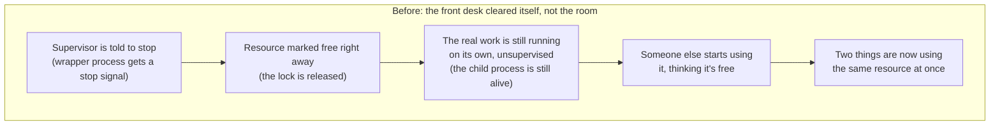
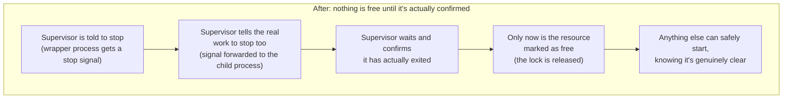

# Making Sure "Stop" Actually Means Stop

*Built while creating the automated test infrastructure for a ride-dispatch app, ahead of its iOS and Android launch.*

## The problem

Picture a shared room key, one key, one room, borrowed from a front desk. To make sure two guests never end up in the room at the same time, you set a simple rule: check with the front desk first. If the room shows as "in use," wait. If it shows "free," go ahead.

Automated software tests run into the exact same problem. This project's tests needed two scarce, shared things at once: a phone, or a simulator standing in for one, to actually run on, and a single shared backend, one database, one set of test accounts, that every test on every device ultimately reached. Two tests running at the same moment could fight over the device itself (a real incident here pushed the shared machine's load average, a standard measure of how overloaded a computer is, to 96 on a machine meant to comfortably handle about 10) or, worse, one test could quietly wipe out data another test was still actively using, producing a result that looked like a pass or fail but actually meant nothing.

The front-desk idea, engineers call it a lock, fixes both problems in principle: whoever wants the shared device or the shared backend checks in first, and waits if someone else already has it.

## Setting up the front desk

The first version worked exactly like the front desk: check whether the key is out before touching anything shared, mark it out while it's in use, mark it back in when done. That part came together without much drama.

The harder version was for the shared backend specifically, because unlike one hotel's front desk, this backend was something every test, on every device, could reach at once. A front desk that only watched two of the doors into the building, while a third door somewhere else let people walk right in without checking, isn't really doing its job. It just looks like it is, until someone walks through the door nobody was watching. A review of the work caught exactly that: the safeguard existed, but it didn't reach every place someone could actually get to the shared backend, so it got rebuilt to sit at the one spot every request genuinely had to pass through.

## The part that actually mattered: what "stop" is supposed to mean

Here's the failure that's easy to miss unless you go looking for it on purpose. Imagine the front desk clerk holding a room's key checked out gets called away suddenly, an emergency, doesn't matter what. If the room automatically gets marked "available" the moment the clerk is gone, that's a real problem, because the guest might still be inside. Nobody told the guest to leave. The front desk just assumed the clerk disappearing meant the room was empty too.

That's precisely what was happening here. A supervising script (engineers would call it a wrapper) would check out the shared resource and hand the real work off to a separate task underneath it (the child). If that supervisor got stopped, by a crash, a timeout, or just being killed by whatever was managing it, its own cleanup fired immediately and marked the resource free again. But the real work underneath kept running completely on its own, unsupervised, invisible to anyone else now confidently starting up because the front desk said the room was clear.

Computers don't automatically stop a task's real work just because the thing supervising it got stopped. You have to explicitly tell the real work to stop too, called forwarding the signal, and then actually confirm it has before you're allowed to say the resource is free again.

The fix: when the supervisor is told to stop, it now passes that same instruction straight to the real work underneath it, and waits, genuinely waits, until that work has actually finished exiting, before marking anything as available again. Not "the message was sent." Confirmed, actually stopped.

## Proving it, not just hoping it

The only honest way to know code like this actually works is to make the failure happen on purpose and watch what occurs, not read the code and assume it's fine. So a small stand-in task was built, one that does nothing but wait quietly, safe to interrupt instead of a real, expensive test. It was run under the same setup as a real test, then deliberately killed from the outside, three separate times, at three different points in the real chain of scripts that actually run one.

Every single time: the stop instruction reached the real work, the real work actually finished exiting, nothing was left running afterward, and the resource was only marked free once that had genuinely happened, never before.

## Before and after

In engineering terms: the supervisor is a wrapper process, the real work underneath it is a child process, and the shared resource being freed or held is a lock.

## By the numbers

Seven separate problems turned up in this system, and each one was a genuinely different way it could fail, not the same issue found twice:

| Problem found | Why it mattered |
|---|---|
| A safeguard put in place too late | It existed, but not soon enough to actually help |
| A safeguard with a gap in its coverage | It watched some doors, not all of them |
| Stop didn't actually mean stop | The most serious of the seven, the one covered above |
| Four more, each its own distinct failure | Not the same issue caught twice, seven real fixes total |

There's one more number worth mentioning, the one that kicked off the whole investigation in the first place:

| | Load average |
|---|---|
| What the shared machine was built to handle | about 10 |
| What it hit during the real incident | 96 |
| What it's measured since the fix | back to normal, never repeated |

## The Why

"It should work" and "it works when I deliberately break it" are two different claims, and only the second one is actually trustworthy. A safety mechanism that's never been tested against real failure isn't a safety mechanism yet, it's an assumption wearing the shape of one. The only way to know it holds is to cause the failure yourself, on purpose, and watch it recover.
