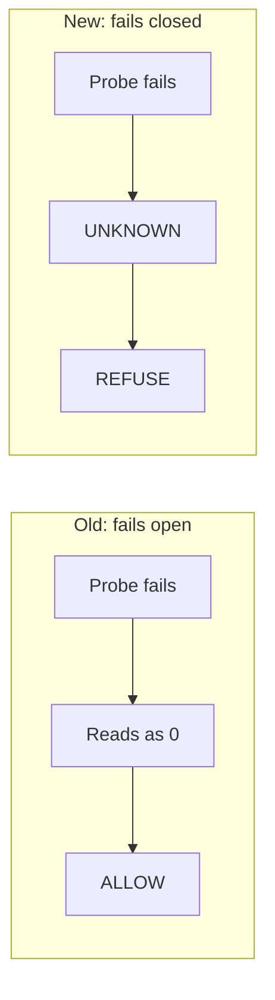

# The Safety Check That Refused a Healthy Machine

*Found and fixed while building automated device tests for a ride-dispatch app on a 16 GB laptop.*

## The problem

Running automated tests on a phone simulator kept making my laptop unusable. In one bad run the system's load reading hit 96, and across a few days the machine was effectively unusable for long stretches. So I did the sensible thing: I wrote a pre-flight check that refuses to start a test run when the machine is already overloaded.

Then the check itself started getting in the way. Twice in a single session it refused to run on a machine that was perfectly fine, once because of "load" and once because of "swap". Each time I added another guard or another workaround. Each guard fixed the last complaint and produced the next one.

That's the trap. I was treating symptoms and trusting numbers I had never actually looked at. It matters because a safety check that cries wolf teaches you to override it, and the day you override it for real is the day it was right.

## The investigation

I stopped patching and measured. I wrote a small sampler (it's in [`code/`](code/)) that records, every couple of seconds: the load average, how idle the CPU actually is, free memory, and how much paging to disk is really happening. Then I ran the pieces one at a time instead of together: idle baseline, boot the simulator alone, boot a second OS version alone, build alone, and only then the test.


On an Apple M5 with 10 cores and 16 GB of memory, it showed three things I had been wrong about.

**1. Booting a simulator pegs the CPU, and that is normal.** For both OS versions I tried, CPU idle sat at **0.0%** for about 35 seconds, dipped briefly, then pegged again in a second wave that ended about a minute after the boot began. The cause is the simulated phone's own background services starting up, not my test or my code.

**2. Memory was tight, but nothing was thrashing.** Before anything started the machine already had 14 to 15 of its 16 GB in use. Over a 20-second window I measured **0 page-outs, 0 swap-ins and 0 swap-outs.**

**3. My checks were reading the wrong numbers.**
- The "load average" stayed at **17 to 55 for minutes after the CPU was already 88 to 94% idle.** It's an average over the last minute, so it lags. My check refused a healthy machine because of it.
- "Swap used" read **1.85 to 2.16 GB and did not move for over 15 minutes**, while live paging was zero. It's a leftover from earlier pressure held by idle programs, not a measure of what's happening now. My check refused a healthy machine because of that too.

A build on its own was modest: **55 seconds, averaging about 1.7 cores.** The cost was the boot, and the fact that every single test run rebooted the simulator from scratch.

## The fix

I changed what the checks read, not how many guards I stacked up.

- **Read live state.** Refuse on current CPU idle and live paging rate, not on the lagging load average or the stale swap figure.
- **Wait for the right thing.** After booting, wait until the CPU has been idle for a stretch, not until a lagging average catches up. Cold boots took **48 to 87 seconds**.
- **Stop rebooting.** An opt-in mode keeps an already-running simulator instead of shutting it down and booting it again. That call took **15 seconds**.

Two consecutive runs then passed with no override flag.

## The fix had the same disease

This is the part I find most useful. An independent AI review of my fix found that it **failed open**. My first version of the new checks turned a failed reading into a healthy-looking number. If the tool that reports paging broke, my check read that as "0 pages per second" and approved the run. A measurement that can't be taken got treated as good news.



The fix is a rule: every probe either returns a valid number or returns nothing and a failure code, and "nothing" means refuse. A second review found a related gap in my "load is high, so look at the CPU" logic: the average lags on the way **up** too. At second 13 of a boot the CPU was at 0% idle while the load average still read 3.85, so a run started in the first seconds of a spike would have been let through. The CPU is now always sampled live.

## By the numbers

All of these were measured on one machine (Apple M5, 10 cores, 16 GB):

- **CPU idle 0.0% for about 35 seconds** during a simulator boot, with a second wave that ended about a minute after the boot began.
- **Load average 17 to 55 for minutes** after the CPU was already **88 to 94% idle**, so it can't be used as a "right now" check.
- **0 page-outs, 0 swap-ins, 0 swap-outs** over 20 seconds while "swap used" read about 1.85 GB.
- **A build alone: 55 seconds, about 1.7 cores.**
- **Cold boot 48 to 87 seconds, versus 15 seconds** when reusing a running simulator.
- **Free memory dipped to about 26 to 28% in a single sample** and recovered above 45% within roughly ten seconds, which is why one low sample should never kill a run.

## What I did not fix

Something at the end of each test run shuts the simulator down. I searched the test tool's source and the system log and did not find what. So each test run still boots the simulator once, and the reuse mode only helps outside those runs. I'd rather say that than imply the problem is gone.

## The Why

When a safeguard keeps misfiring, the instinct is to add another safeguard. The better move is to stop and measure what's actually true, because the number you're trusting is often measuring something other than what you think. And when a check can't read its own input, the safe default is "I don't know, so I won't proceed", never "nothing to report, so go ahead."

## Code Sketch

<details>
<summary><b>Show the code sketch: reading a probe that can fail</b></summary>

<br>

*A simplified illustration written for this write-up, not production code. It covers the one rule that fixed my safety check: a reading that can't be taken is "unknown", and unknown means refuse.*

```bash
# Prints a valid non-negative number and returns 0, or prints NOTHING and
# returns 1. It never turns a failed read into a healthy-looking "0".
counter_new() {
  out=$(vm_stat 2>/dev/null | awk '/^Pageouts:/{p=$NF; sub(/\./,"",p); hp=1} /^Swapouts:/{s=$NF; sub(/\./,"",s); hs=1} END{ if (hp && hs && p ~ /^[0-9]+$/ && s ~ /^[0-9]+$/) printf "%d", p+s }')
  [ -n "$out" ] || return 1
  echo "$out"
}

a=$(counter_new) || { echo "REFUSE (cannot measure paging: machine state UNKNOWN)"; return; }
```

The case that matters is a broken probe. On a healthy machine and on a thrashing one, the old check and the new one agree. They only differ when the measurement itself fails:

```
machine      | OLD gate (fails open)              | NEW gate (fails closed)
-------------+------------------------------------+------------------------
healthy      | ALLOW  (paging 0 pages/s)          | ALLOW  (paging 0 pages/s)
broken       | ALLOW  (paging 0 pages/s)          | REFUSE (cannot measure paging: machine state UNKNOWN)
thrashing    | REFUSE (paging 50000 pages/s)      | REFUSE (paging 50000 pages/s)
```

The full sketch, with the old and new versions side by side, the measurement tool, and a note on a choice I made on purpose, is in [code-sketch.md](code-sketch.md). The runnable versions are in [`code/`](code/).

</details>
