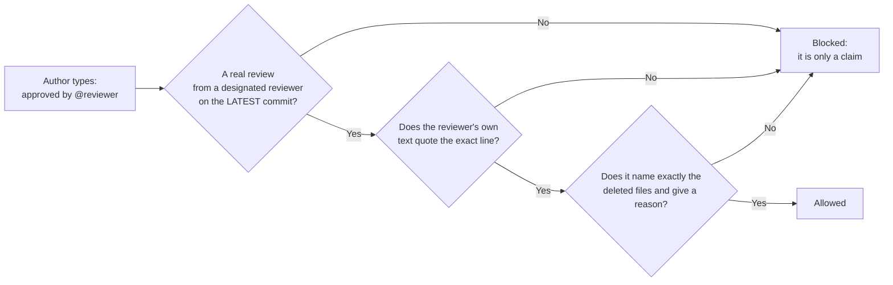

# A Merge Gate That Never Trusts a Sentence Someone Typed

*Built while developing a ride-dispatch app for iOS and Android, as the product builder using AI-assisted development.*

## The problem

I build with AI assistants that open and merge changes under my own account. I wanted a simple rule for the risky ones: a human has to approve before it goes in.

My first version of that rule was a line in the change description: "approved by me." That's the problem in one sentence. Anyone can type it. So can an AI assistant working as me, or I can type it half-asleep at the end of a long day. A rule you can satisfy by typing the sentence isn't a rule. It's a suggestion with extra steps.

It matters most for the quiet changes. Deleting a test file is the cheapest way to weaken a safety net, and nothing breaks when you do it. Skipping an expensive device test "just this once" is the same kind of change. Those are exactly the moments the human check exists for, and exactly the moments a typed sentence would wave straight through.

## What I built

A gate that looks at every proposed change and decides two things: which expensive device tests it must run, and whether it needs a human sign-off before it can merge.

The part this write-up is about is the second one, and it comes down to one idea:

> A sentence in the description is only a **claim**. It counts as an approval only if a designated reviewer really approved the **latest** version of the change, and their **own review text quotes that exact sentence**.



Anything the gate can't read, can't verify, or finds ambiguous ends in **blocked**, never in allowed. I call that failing closed.

## How it got hard

I didn't design that rule in one pass. I built a first version, then ran it through rounds of adversarial AI review, where a second AI's only job is to find a way to get a change through the gate that shouldn't get through. Every round found something real. In plain terms:

- **The typed approval was forgeable.** The first version trusted the sentence. Fix: require a real review from a designated person.
- **A generic "looks good" could be replayed.** A reviewer approves, then the author edits the description to add a sentence the reviewer never saw. Fix: the reviewer's own text must quote the exact line.
- **A near-miss file name counted.** The check used "contains", so approving `old_test.dart.bak` satisfied a deletion of `old_test.dart`. Fix: whole-path matching that must equal the deleted set.
- **A deleted test could slip past depending on how it was filed.** A deleted README inside the test folder was classified as documentation and skipped the check. Fix: detect deletions by path before any classification.
- **One exception waived everything.** A single bare line could waive every untested scenario. Fix: an exception must name the exact scenarios and give a reason, and it waives only those.
- **A green check could go stale.** If the target branch moved after the last update, nothing re-ran, and an old green result could still merge. Fix: require up-to-date branches, and fail closed if the gate's base differs from the branch's current tip.

The full list, with what each one let a careless or hostile author do, is in [`review-findings.md`](review-findings.md).

## By the numbers

- **About 2,400 lines of gate code and about 2,800 lines of tests: 176 tests.** The test file is deliberately larger than the code. Many of them run the real program against real temporary git repositories rather than mocks.
- **Over a dozen independent review passes found roughly two dozen distinct defects.** Each one is logged with what was done about it, including the few I could not fully fix.
- **3 and 5 failing checks** when two of the real bugs were put back into the public extract, to prove the tests can fail (details in the code sketch).

## Where this stands

The gate is built, tested (176 tests, run locally against real git repositories) and independently reviewed. I've deliberately left it in advisory mode: it reports what it would do and blocks nothing. I won't turn enforcement on until the main user journeys have automated tests behind them. Until then a green check means "these tests were selected", not "these tests passed", and the gate's own summary says exactly that. Wiring it into my pipeline is the next step once those journeys are automated.

## The Why

The lesson isn't about merge gates. It's that a control is only as strong as the weakest thing that can satisfy it. If satisfying the control takes nothing but typing, the control protects against nobody who wasn't already going to behave. The useful move is to stop asking "did someone say yes" and start asking "can I verify, from something the author doesn't control, that a specific person said yes to this exact version." Fail closed, and make the evidence come from the reviewer, not the author.

## Code Sketch

<details>
<summary><b>Show the code sketch: the approval check</b></summary>

<br>

*A simplified illustration written for this write-up, not production code. It covers the one idea at the heart of the gate: a typed approval is only a claim until a real reviewer's own words back it up.*

```dart
/// Designated reviewers whose LATEST decisive review is APPROVED, made on the
/// current head commit, mapped to what that review said.
///  * a COMMENTED review changes nothing;
///  * CHANGES_REQUESTED or DISMISSED after an approval revokes it;
///  * an approval of an older commit does not count: new commits start over.
Map<String, String> verifiedApprovers({
  required List<Review> reviews,
  required List<String> designated,
  required String headSha,
}) {
  final allowed = designated.map((d) => d.toLowerCase()).toSet();
  final latest = <String, Review>{};
  for (final r in reviews) {
    final s = r.state.toUpperCase();
    if (s == 'APPROVED' || s == 'CHANGES_REQUESTED' || s == 'DISMISSED') {
      latest[r.user.toLowerCase()] = r;
    }
  }
  return {
    for (final e in latest.entries)
      if (allowed.contains(e.key) &&
          e.value.state.toUpperCase() == 'APPROVED' &&
          e.value.commitId == headSha)
        e.key: e.value.body,
  };
}
```

The test that matters most protects the quiet attack: a reviewer says "looks good", and the author edits the description afterwards to add a sentence the reviewer never saw.

```dart
final replay = pr(
  description: line, // the author added this AFTER the review
  reviews: [Review('reviewer-one', 'APPROVED', head, body: 'Looks good.')],
);
check(!decide(replay, designated: designated).allowed, 'REPLAY is blocked');
```

The reviewer's review doesn't contain the sentence, so it was never approved. The gate treats the sentence as what it is: something the author typed.

The full sketch, with all 11 scenarios, the tests that prove the tests can fail, and a note on a choice I made on purpose, is in [code-sketch.md](code-sketch.md). The runnable version is in [`code/`](code/).

</details>
